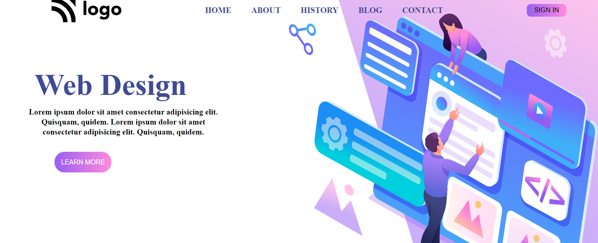

# Assigment 1

# **Project-1**
>- Skills gained in this project
 >- I learned about how to use poisition in css [Relative and absolute]
 >- learned about how to use css selectors like:nth-child() :last-child, first child and chained selector 
  >-learned about background poisition, backgrond size a more about linear-gradient

 ***
 **Time taken to finish to this project**
 
 >-It took me 2 hour to complete this project 

 **Screenshot**
 
 